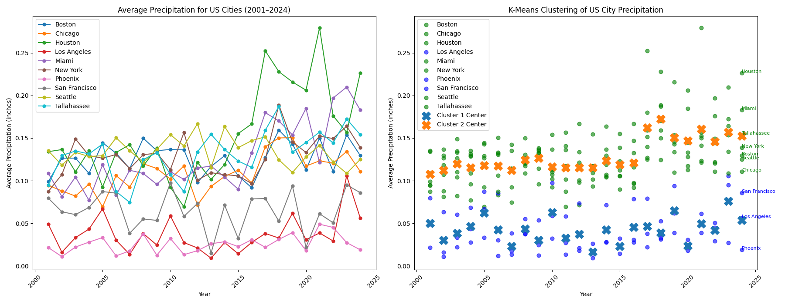

# Climate Data Analysis and Prediction System

A comprehensive Python application for analyzing weather patterns, detecting anomalies, and predicting precipitation trends across major U.S. cities using machine learning algorithms.



## Technologies Used

- **Python 3.11+**
- **Data Science**: pandas, numpy, scipy
- **Machine Learning**: scikit-learn, Facebook Prophet
- **Visualization**: matplotlib
- **API Integration**: Open-Meteo Weather API
- **GUI**: tkinter
- **Testing**: pytest

## Algorithms Implemented

### 1. Anomaly Detection (Rolling Window Z-Score)
- **Purpose**: Identify days with unusual precipitation levels
- **Method**: Uses a 30-day rolling window to calculate Z-scores
- **Threshold**: Configurable (default: 3.0 standard deviations)
- **Output**: Boolean array marking anomalous weather events

### 2. Climate Clustering (K-Means)
- **Purpose**: Group cities with similar precipitation patterns
- **Features**: Yearly precipitation averages (2001-2024)
- **Distance Metric**: Euclidean distance
- **Visualization**: Dual-plot showing trends and clusters

### 3. Precipitation Forecasting (Facebook Prophet)
- **Purpose**: Predict next 30 days of precipitation
- **Features**: Handles seasonality, trends, and holidays
- **Input**: 25 years of historical daily data
- **Output**: Daily precipitation forecasts with confidence intervals

## Project Structure

```
├── src/
│   ├── main.py              # GUI application entry point
│   ├── algorithms.py        # ML algorithms implementation
│   ├── data_processor.py    # Weather data fetching and processing
│   ├── visualizer.py        # Visualization components
│   └── cli.py              # Command-line interface
├── data/                   # Weather data CSV files (10 cities)
├── tests/                  # Unit tests
├── requirements.txt        # Python dependencies
└── README.md              # This file
```

## Quick Start

### Prerequisites
- Python 3.11 or higher
- Internet connection (for data fetching)

### Installation

1. **Clone the repository**
   ```bash
   git clone https://github.com/yourusername/climate-analysis-system.git
   cd climate-analysis-system
   ```

2. **Install dependencies**
   ```bash
   pip install -r requirements.txt
   ```

3. **Run the application**
   ```bash
   python src/main.py
   ```

### Using the GUI

1. **Process Data**: Download latest weather data (optional - sample data included)
2. **Clustering**: Analyze precipitation patterns across cities
3. **Predict Trends**: Generate 30-day precipitation forecasts
4. **Time Series**: Detect anomalies in historical data
5. **Help**: View usage instructions

## Sample Results

### Clustering Analysis
The K-Means clustering reveals distinct precipitation patterns:
- **Dry Climate Cities**: Phoenix, Los Angeles
- **Moderate Climate Cities**: San Francisco, Seattle
- **High Precipitation Cities**: Miami, Houston

### Anomaly Detection
Successfully identifies:
- Extreme storm events
- Drought periods
- Seasonal anomalies
- Climate change indicators

### Forecasting Accuracy
- Prophet model accounts for seasonality and long-term trends
- Better performance than linear regression for weather data
- Handles irregular patterns and extreme events

##Cities Analyzed

- Boston, MA
- Chicago, IL
- Houston, TX
- Los Angeles, CA
- Miami, FL
- New York, NY
- Phoenix, AZ
- San Francisco, CA
- Seattle, WA
- Tallahassee, FL

## Testing

Run the test suite:
```bash
python -m pytest tests/
```

## Data Source

Weather data sourced from [Open-Meteo Historical Weather API](https://open-meteo.com/):
- **Time Range**: November 2000 - April 2025
- **Resolution**: Daily precipitation totals
- **Units**: Inches
- **Coverage**: 10 major U.S. cities

## Configuration

### Anomaly Detection Parameters
- `window_size`: Rolling window size (default: 30 days)
- `threshold`: Z-score threshold (default: 3.0)

### Clustering Parameters  
- `k`: Number of clusters (user-configurable)
- `years`: Analysis period (2001-2024)

### Forecasting Parameters
- `forecast_days`: Prediction period (default: 30 days)
- `seasonality`: Daily seasonality enabled
